# Product Management API

This is a REST based server for a simple e-commerce application made with Node.js and Express.js and can perform the following functionalities:

- **Product Management**: Create a new product with details such as name, description, price, and category. Retrieve a list of all products or filter by category. Update the details of an existing product. Delete a product.
- **Cart Management**: Create a new cart for a user. Add a product to the user's cart with a specified quantity. Remove a product from the user's cart. Retrieve the contents of the user's cart.
- **Order Placement**: Place an order by converting the contents of the user's cart into an order. Store the order details, including the user's information, product details, and total cost. Retrieve order details by order ID.
- **Authentication and Authorization**: Authentication system to secure the API endpoints using JWT tokens that ensures that only authenticated users can access and modify their cart and order information.
- **Data Persistence**: Uses a Supabase SQL db to store user, product, cart and order data.

It also has error handling functionalities using a global error handler and returns appropriate HTTP status codes for different scenarios.

**The API is hosted on vercel.** You can also try the below provided routes by using https://product-management-api-psi.vercel.app/ with an api tester like postman.

## Contents

- [Product Management API](#product-management-api)
  - [Contents](#contents)
  - [Database](#database)
  - [User Routes](#user-routes)
    - [Create a User](#post-users-public)
  - [Adding authentication header](#adding-authentication-header)
  - [Product Routes](#product-routes)
    - [Get all products](#get-products-public)
    - [Create a product](#post-products-protected)
    - [Update a product](#patch-products-protected)
    - [Delete a product](#delete-products-protected)
  - [Cart Routes](#cart-routes)
    - [Add to cart](#post-cartadd-protected)
    - [Remove from cart](#post-cartremove-protected)
    - [Get cart details](#get-cart-protected)
  - [Order Routes](#order-routes)
    - [Place order](#post-order-protected)
    - [Get order details](#get-orderorderid-protected)
  - [Try it out with Swagger UI](#try-it-out-with-swagger-ui)

## Database

The database is a postgresql by supabase. It includes the following tables:
- Users (`id`, `name`, `email`, `password`, `created_at`)
- Products (`id`, `name`, `description`, `price`, `category`, `created_at`)
- Carts (`id`, `foriegn: userId`)
- Cart_items (`id`, `foriegn: cartId`, `foriegn: productId`, `quantity`)
- Orders (`id`, `foriegn: userId`, `total_cost`, `quantity`, `created_at`)
- Order_items (`id`, `foriegn: orderId`, `foriegn: productId`, `quantity`)

## User Routes

### POST /users (public)

Creating a user on the application is necessary because it provides us with a **JWT token** which is required to access most of the protected API endpoints. The JWT token is signed with the newly created user's Id.

#### Body
| Field | Type | Required | 
| :---- | :---- | :---- | 
| `name` | `string` | yes |
| `email` | `string` | yes |
| `password` | `string` | yes |

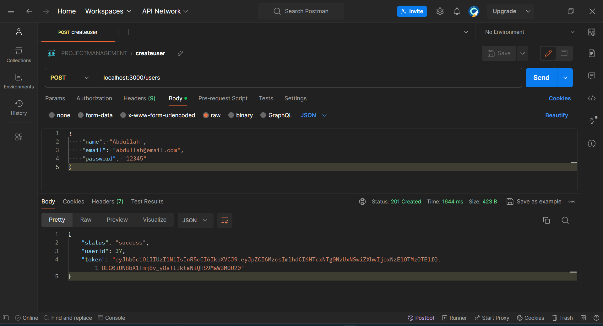

## Adding authentication header

To access the protected Api's, the **JWT token** recieved when creating the user should be plugged in to the **authentication header** with type set tp bearer token.

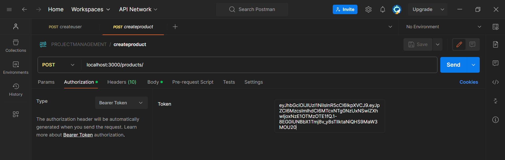

## Product Routes

### GET /products (public)

Retrieves all the products in the database.

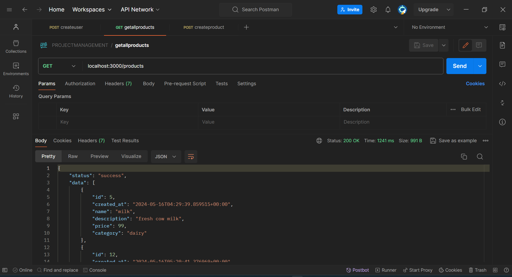

### POST /products (protected)

Creates a product with the provided data. Only authorized users can create products.

#### Body
| Field | Type | Required | 
| :---- | :---- | :---- | 
| `name` | `string` | yes |
| `description` | `string` | yes |
| `price` | `float4` | yes |
| `category` | `string` | yes |

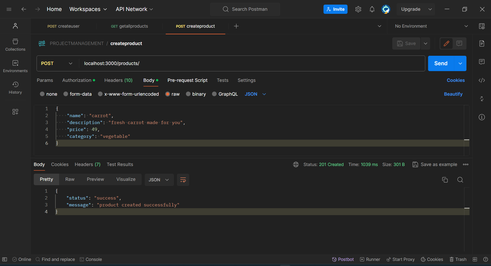

### PATCH /products (protected)

Updates a product with the provided values.

#### Body
| Field | Type | Required | 
| :---- | :---- | :---- | 
| `name` | `string` | optional |
| `description` | `string` | optional |
| `price` | `float4` | optional |
| `category` | `string` | optional |

### DELETE /products (protected)

Deletes a product with the provided product id.

#### Body
| Field | Type | Required | 
| :---- | :---- | :---- | 
| `productId` | `int8` | yes |

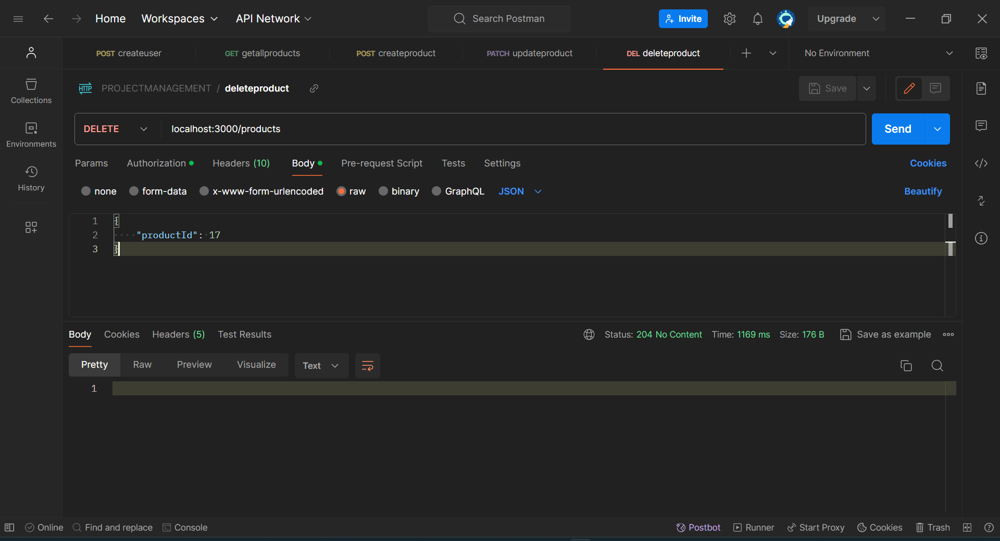

## Cart Routes

### POST /cart/add (protected)

Adds the given product Id to the user's cart. The user's Id is deceoded from the JWT token ensuring that no other user can manipulate someone's cart. If the product is already in cart, then quantity is updated.

#### Body
| Field | Type | Required | 
| :---- | :---- | :---- | 
| `productId` | `int8` | yes |
| `quantity` | `int2` | yes |

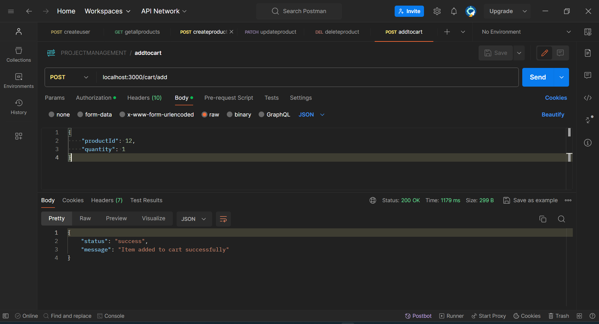

### POST /cart/remove (protected)

Removes the given product with Id from the user's cart. The user's Id is deceoded from the JWT token ensuring that no other user can manipulate someone's cart. 

#### Body
| Field | Type | Required | 
| :---- | :---- | :---- | 
| `productId` | `int8` | yes |

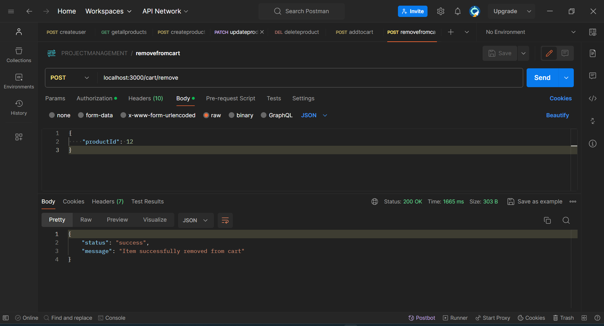

### GET /cart (protected)

Returns the user's cart details. The user's Id is deceoded from the JWT token ensuring that no other user can manipulate someone's cart. 

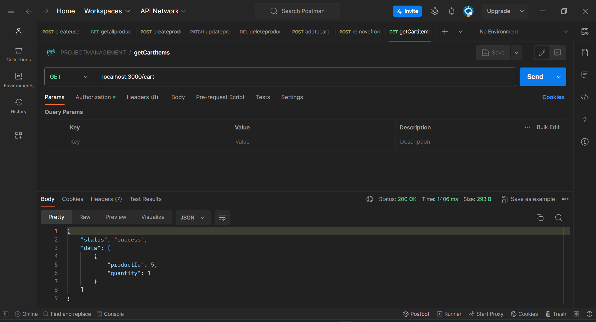

## Order Routes

### POST /order (protected)

Places an order by converting the cart items and calculates the total amount and empties the cart. Returns error if cart is empty while placing order.

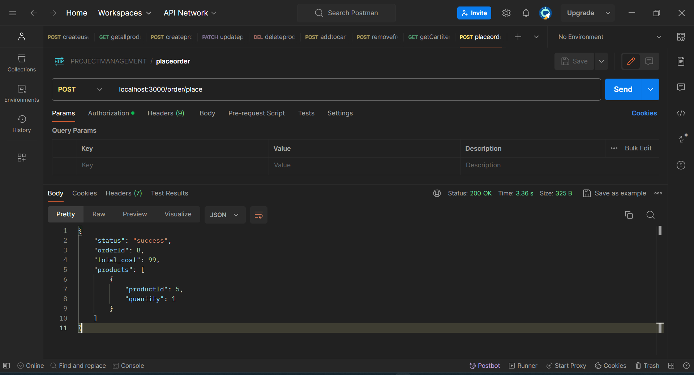

### GET /order?orderId= (protected)

#### Parameters
| Key | Value | Required | 
| :---- | :---- | :---- | 
| `orderId` | `int8` | yes |

Return details of the order for the given id.

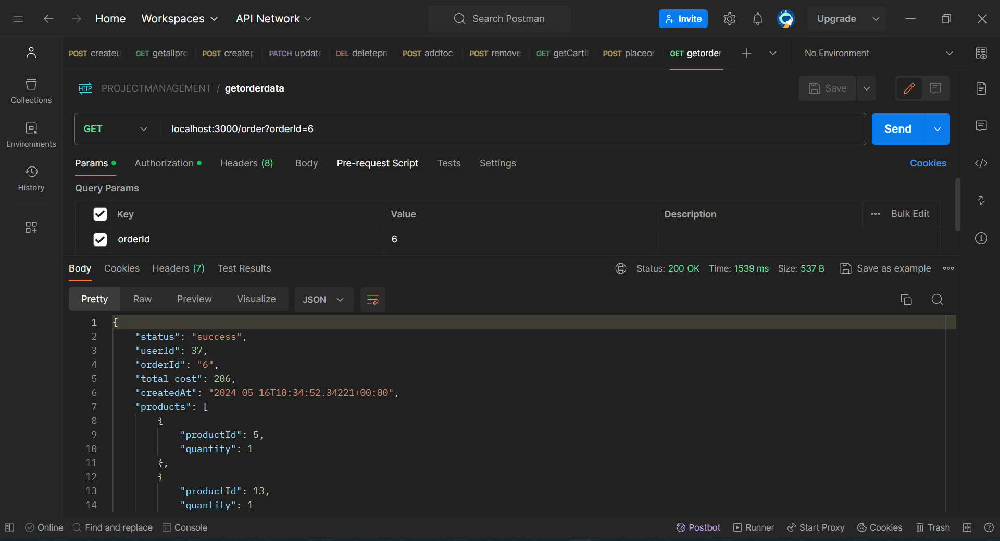

## Try it out with Swagger UI

Documentation for the API endpoints, including the request and response formats, can be tried using swagger. However, to do this you will need to run the application locally with a supabase connection.

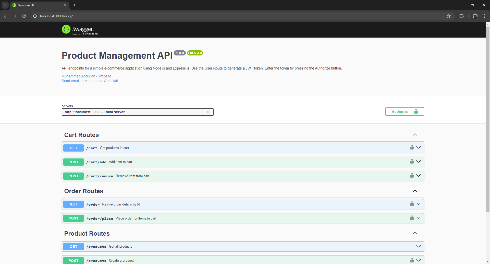
